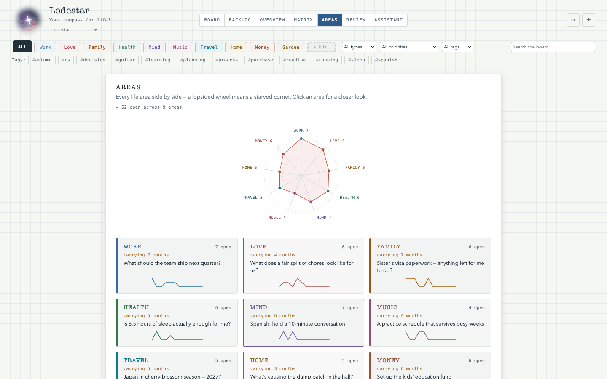
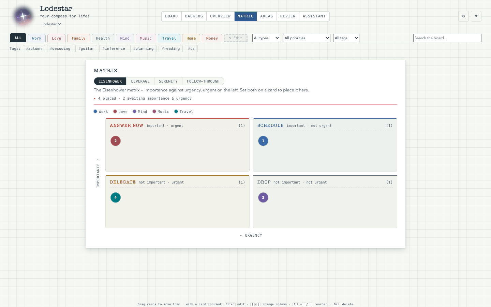
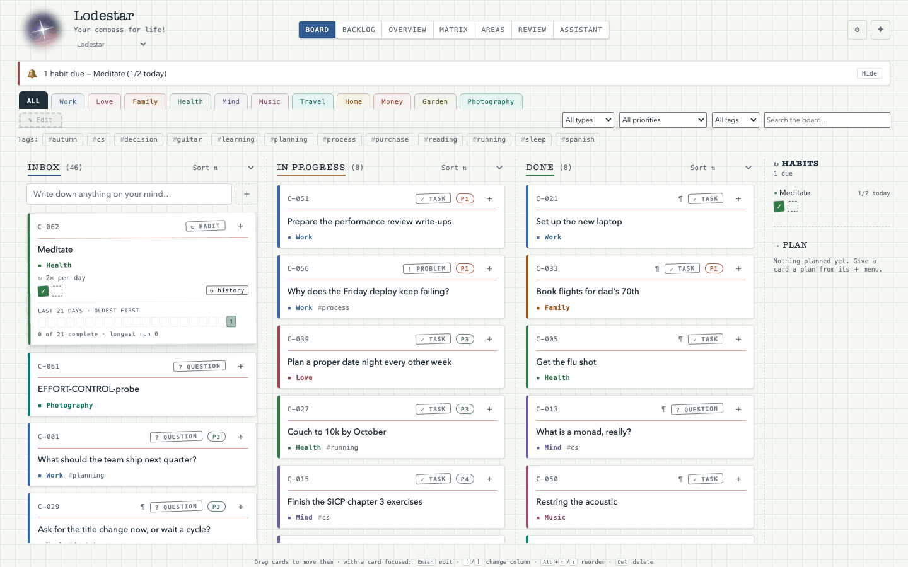
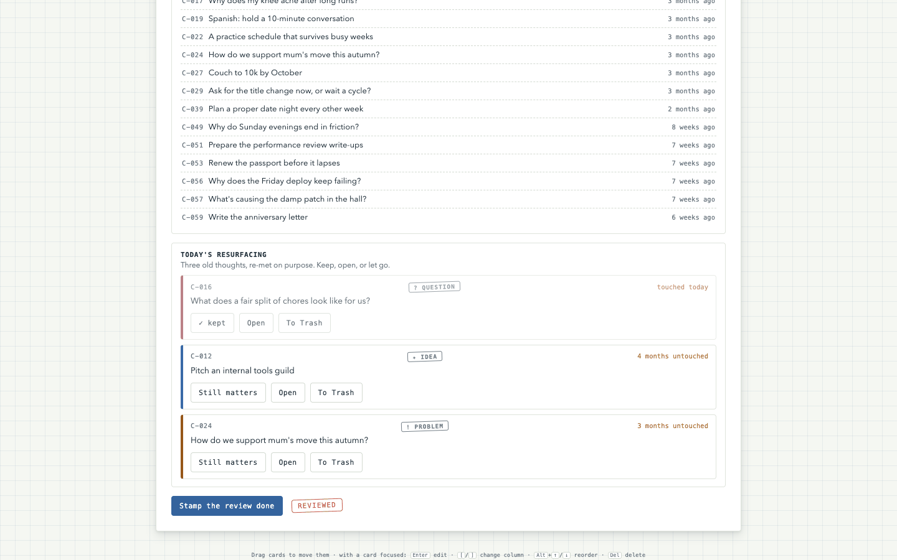
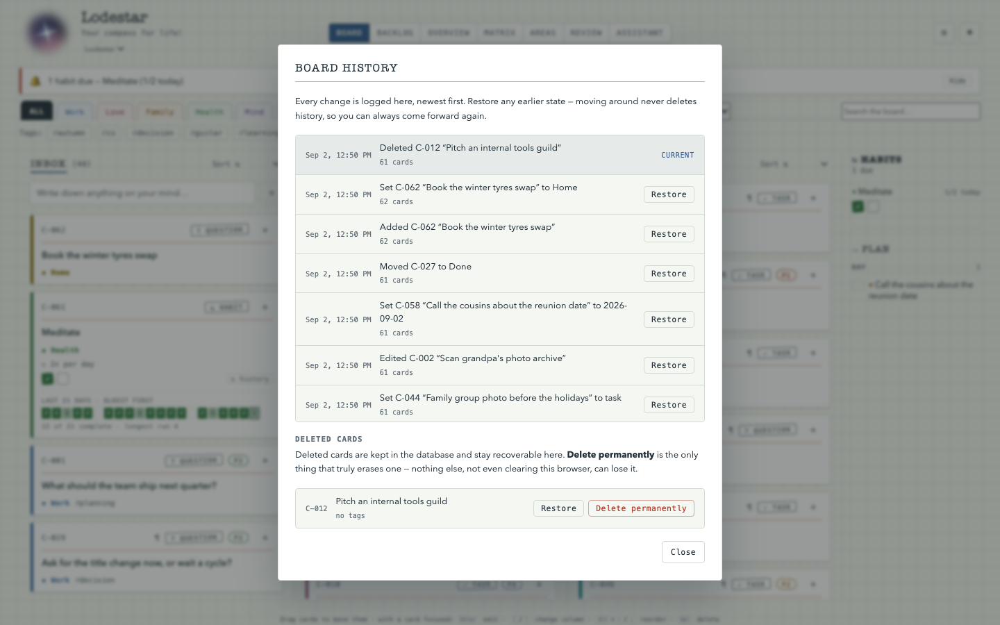
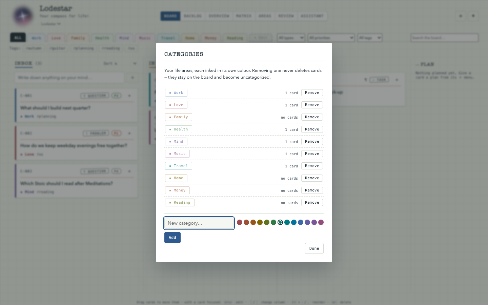

# Lodestar

*Your compass for life.*

One board for your whole life — work, love, family, health, mind, music, travel, home, money.
Every open question, task, habit and dream sits in one place, so none of it has to live in your head.


**What makes it different**

- **Built for a life, not a sprint.** A card is a question, a problem, a task, an idea, a dream or a
  habit, filed under a life area rather than a project.
- **Yours, on your machine, keyless.** No account, no cloud, no API key: vanilla HTML/CSS/JavaScript,
  a zero-dependency Node server, one SQLite file — and by default even the AI models run locally.
  Clone it and `npm start`; there is no install step and no build step.
- **The assistant proposes, you decide.** It has no way to write to your board: a card it invents
  waits for your approval, and an edit it suggests opens in the ordinary card dialog for you to change.
- **Nothing disappears quietly.** Destroying a card takes two deliberate acts, a save that looks
  lossy archives to the Trash instead of deleting, and the database keeps backing itself up.
- **It looks like an engineer's card ledger.** Quad-ruled paper, ruled index cards with permanent IDs
  (`C-001`, `C-002`, …), card types as ink stamps, life areas as coloured index tabs.

## Features

- **Three-column lifecycle**: Inbox → In Progress → Done, with drag & drop and full keyboard support
- **Seven views**: Board, Backlog (the Inbox as a scannable list), Overview (a semantic map — cards plotted by meaning, embedded in-browser), Matrix (importance crossed with urgency, effort, control, or staleness), Areas (which part of your life is starved), Review (the GTD weekly sweep), and Assistant (chat with the brain)
- **Card types**: question, problem, task, idea, dream, habit — habits repeat rather than finish, wear a punch strip of per-period tick boxes, and remind you when due
- **Categories**: ten life areas to start, each with its own colour; add, remove, and recolour up to 24. Every board keeps its own set
- **Deadlines and derived priority**: importance × urgency gives P1–P4, never stored, so it can't disagree with the judgements behind it
- **Plan dates**: any card can say when you mean to get to it — a year, a year and month, or a full day. It follows the deadline until you set it by hand, and a rail beside the board groups the planned cards by how near they are
- **Quick capture, search, filters, tags**, and a pro/con balance sheet on any card tagged `decision`
- **Undo & History**: every change is logged and any logged state can be restored, git-style
- **Four themes**, following your system preference until you pick one

## A look at it

Every shot below is a real screenshot from the end-to-end test suite or a live
recording — none is a mockup. The card text in them comes from the six seed
cards the app ships with and from the demo board in `sample-overview.json`, both
already in this repository, so none of it is anyone's real board. Details of
each image, and what it is evidence for, are in
[`docs/img/README.md`](docs/img/README.md).

| | |
| --- | --- |
|  **Areas** — nine life areas side by side. A lopsided wheel means a starved corner. |  **Matrix** — importance against urgency, placed by the card's own fields. |
|  **Habits** — a due banner, a rail, and a 21-day tape per habit. |  **Review** — three old thoughts re-met on purpose: keep, open, or let go. |
|  **History** — every change logged and restorable; only *Delete permanently* really erases. |  **Life areas** — yours to name and colour; removing one never deletes its cards. |

## Run it

Needs **Node 23.4+** (for built-in `node:sqlite`) and, for the Assistant, **uv**. The board alone is enough to capture and organise cards; each further service adds a capability and degrades cleanly when absent.

```sh
git clone https://github.com/S-Moha-M-Kashani/lodestar.git
cd lodestar
npm run auth:setup                       # once — prints a line for .env
npm start                                # the board on http://localhost:3000
```

`npm run auth:setup` asks for a password without echoing it and prints one line
(`LODESTAR_AUTH_PASSWORD_HASH=…`) to put in `.env`; the server refuses to boot
without it. Apart from that there is nothing to install and nothing to build:
the server has zero dependencies and the frontend is native ES modules, so
there is no `npm install` step and no bundler.

**Lodestar answers on this computer only, and asks for the password even
there.** It listens on `127.0.0.1`, refuses any `Host` other than the local
ones, and puts every board and chat route behind a session — so a peer on the
same university or café Wi-Fi cannot reach it at all. There is no LAN mode and
no "trusted network" detection; to use the board from another device, forward
the loopback port over Tailscale/WireGuard or an SSH tunnel and log in as
usual. [`docs/security.md`](docs/security.md) covers all of it.

For the **Assistant**, start the brain (port 9000) in a second terminal:

```sh
set -a; . ./.env; set +a                 # if you keep a .env — uvicorn never reads it itself
uv run --project brain --extra local-embeddings uvicorn lodestar_brain.server:app --port 9000
```

The `local-embeddings` extra is ~1 GB of torch for real semantic retrieval; `BRAIN_EMBEDDER=fake uv run --project brain uvicorn …` skips it and makes retrieval lexical. The default chat backend is a local model via [Ollama](https://ollama.com):

```sh
ollama pull 4skl/gemma4-e2b-mtp          # the default BRAIN_MODEL
```

`OPENROUTER_API_KEY` plus `BRAIN_LLM=openrouter` switches chat to a hosted model — the key lives only in the brain's environment; the browser never sees it. Chat memory (the assistant recalling past conversations) needs a [Chroma](https://www.trychroma.com/) server on :8003 (`docker compose up -d chroma` starts one); without it the brain logs a warning, disables recall, and serves everything else.

Or run board and brain together with Docker (Chroma and Ollama stay on the host):

```sh
docker compose up --build                # then open http://localhost:3000
```

Chat still needs a model from the host's side: have Ollama running, or `export OPENROUTER_API_KEY=… BRAIN_LLM=openrouter` before composing. Without either, chat fails while the board and every non-chat feature keep working.

Every backend — chat model, embedder, transcriber, search — is chosen by an env var, and an unknown value raises at boot rather than silently picking something else. Every variable is documented in `.env.example`, and the same settings are commented in `docker-compose.yml`.

## How your data is stored

Local-first: the browser keeps a working copy in `localStorage`, and the Node server persists every change to a single SQLite file (`board.db`, or wherever `BOARD_DB` points). No external database server, no cloud dependency, and boards never sync off the machine.

One deliberate durability guarantee: **a card is destroyed only by a two-step act** — delete it from the board, then "Delete permanently" from the Trash. A save missing some cards archives them to the Trash rather than removing them, so a partial or buggy write can never blank your board. Export/Import as JSON moves a board deliberately.

Every test run backs up `board.db` first (timestamped copies under `backups/`, plus Google Drive if [rclone](https://rclone.org/) is configured — one-time OAuth, no Google password ever stored or read), and the server snapshots the database whenever a save brings a card it has never seen.

## The Assistant

The Assistant view talks to the brain — one function-calling agent that researches questions on the web (with cited urls), operates the board in plain language, finds connections between your cards (hybrid dense + BM25 retrieval with a relevance gate, so it can honestly say *"I have nothing on that"*), and recalls past conversations. Each reply shows the tools it actually called.

It cannot put a card on your board by itself: a card it invents is a **proposal**, held off the board until you approve it, and an edit it suggests opens in the ordinary card dialog for you to change and apply. Deleting is yours alone. A mic beside Send dictates into the composer — locally by default (Parakeet on Apple Silicon), and the transcript is editable text, never auto-sent.


*The gate, still and then in motion, both recorded against a live model.* The assistant answers,
proposes a card, and stops. Nothing reaches the board until **Approve** is pressed — and then it
arrives as an ordinary card with a ledger number of its own. What was recorded to make these, and
why it had to be a live model rather than the test suite's fake one, is in
[`docs/img/README.md`](docs/img/README.md).

Privacy is a design rule, not a setting: conversations are never sent to any tracing or analytics service, web snippets and recalled text are fenced as data rather than instructions before the model reads them, and every link a web search returns is safety-checked before the model may cite it.

## Why I built this

Every tool I tried was built for work. They assume a project, a sprint, a
deadline — and the things that actually take up room in a head are not shaped
like that. *"How do we support mum's move this autumn?"* is not a ticket. It is
a question that will sit unresolved for months, that belongs beside a guitar I
mean to restring and a deploy that keeps failing on Fridays, and that no
kanban board has a column for. So the things I most needed to stop carrying
were the things no tool would hold, and they stayed in my head.

Lodestar is the tool that holds them. A card can be a *question* with no answer
yet, and that is a legitimate state to be in rather than a task nobody has
started. Nine life areas sit at the same level, so work cannot quietly take the
whole board. Nothing is ever deleted by accident, because the whole promise
falls apart the first time it loses something. And it runs on my own machine
with no account and no cloud, because a board holding this much of a private
life should not be somewhere else.

The AI part came last and deliberately weakest: it can read everything and
write nothing. See below.

## How it's built

Three services, each degrading cleanly when the next one is absent:

- **The browser** — vanilla HTML, CSS and JavaScript as 51 native ES modules,
  no framework, no bundler, no build step. `index.html` loads one entry point.
- **The board server** (`:3000`) — the whole backend in one file of raw
  `node:http` and `node:sqlite`, with **one** npm dependency (`pg`, and only
  because Postgres has no equivalent in the standard library). It owns the
  SQLite databases, serves the frontend, and proxies the assistant so the API
  key never reaches the browser.
- **The brain** (`:9000`) — a Python FastAPI service wrapping one LangGraph
  agent: tools, hybrid retrieval over your cards, and chat memory in
  [Chroma](https://www.trychroma.com/) (`:8003`) when it is running.

Four things are worth more than the diagram:

- **The assistant has no write path to the board at all.** Not a permission it
  is denied — the set of mutating tools is empty and the brain's board client
  carries no save method. A card it invents is a row waiting for your click.
- **Every backend is a seam chosen by an environment variable, and none has an
  `auto` mode.** Chat model, embedder, reranker, relevance gate, transcriber,
  search, link safety, tracing. An unknown value raises at boot rather than
  quietly picking something — because a config that silently transcribed
  privately on one machine and billed a paid API on another is a bug this
  project already shipped once.
- **The prompt-injection defence is a fence, and its measurement is published
  rather than implied**: 3 of 12 hostile payloads got through on
  `openai/gpt-5-nano` — 25%, all three in the card-notes channel. Written down
  because a security claim with no number behind it is marketing.
- **The server owns the board whenever it answers.** Two laptops and one board
  server once cost 24 cards; the protocol that replaced that is a hash of the
  exact bytes a client was sent, and it is the most carefully argued code here.

Full detail, with a link to the source or test behind every claim:
**[`ARCHITECTURE.md`](ARCHITECTURE.md)**, and the fourteen dated design records
in [`docs/decisions/`](docs/decisions/) — each written before its code and kept
afterwards, several carrying an amendment saying where reality disagreed.

## Contributing, and your own data

This is a personal project under a proprietary licence, so there is no
contribution process and no pull requests. Issues pointing out a bug or a wrong
claim are welcome.

**If you do run a copy, two things matter:**

- **Never put a real database or a real conversation anywhere near a commit,
  an issue, or a screenshot.** `databases/` and `backups/` are ignored
  wholesale, every test entry point backs up `board.db` before it runs, and
  [`scripts/release-hygiene.mjs`](scripts/release-hygiene.mjs) scans a branch's
  whole *history* — not just its current tree — for database paths and for
  identifiers you name, refusing to pass if it finds any. A file deleted in a
  later commit is still reachable from the branch; that gate exists because the
  tidy-up commit is what people do instead of a rewrite and it looks identical
  from outside.
- **The security boundary is loopback plus a password**, and it is not a
  suggestion: the server binds `127.0.0.1`, allows an exact set of `Host`
  values rather than a pattern, and fails to boot if the password hash is
  missing or malformed. [`docs/security.md`](docs/security.md) explains what
  that does and does not protect, and what to do instead of exposing a port.

Before publishing anything, [`docs/release-checklist.md`](docs/release-checklist.md)
lists every gate with the command that checks it.

## Tests

Developed test-first; all four layers run fully offline (deterministic fake LLM and embedder — no key, no network):

```sh
npm run test:server                                 # server + backup unit suites
uv run --project brain pytest brain/tests -v        # brain unit tests
uv run --with playwright python tests/e2e_test.py   # full e2e — starts everything itself
npm run test:all                                    # all of the above
```

## License

Proprietary — all rights reserved; published for portfolio and demonstration
purposes only. See [`LICENSE`](LICENSE).

**You may clone this repository and run it on your own machine**, exactly as
*Run it* above describes. That permission is granted deliberately and it is the
whole of it: a life dashboard you cannot run is a screenshot.

**Everything else is reserved.** Not for use in another project, commercial or
not; not to be modified, redistributed, or run as a service for anyone else.
For anything beyond your own local copy, ask: s.moha.m.kashani@gmail.com
